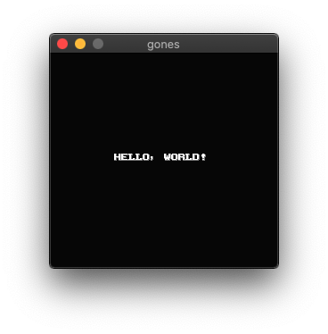

# gones

[](https://github.com/dqn/gones/actions)

Toy NES emulator written in Go.

## Installation

```bash
$ go get github.com/dqn/gones
```

## Usage

```bash
$ gones <nes-file-path>
```



## License

MIT
